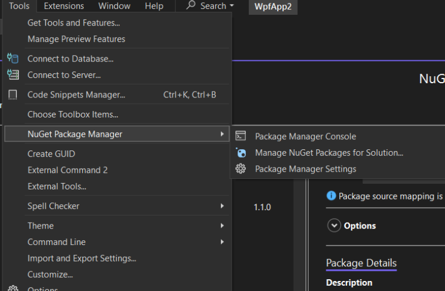
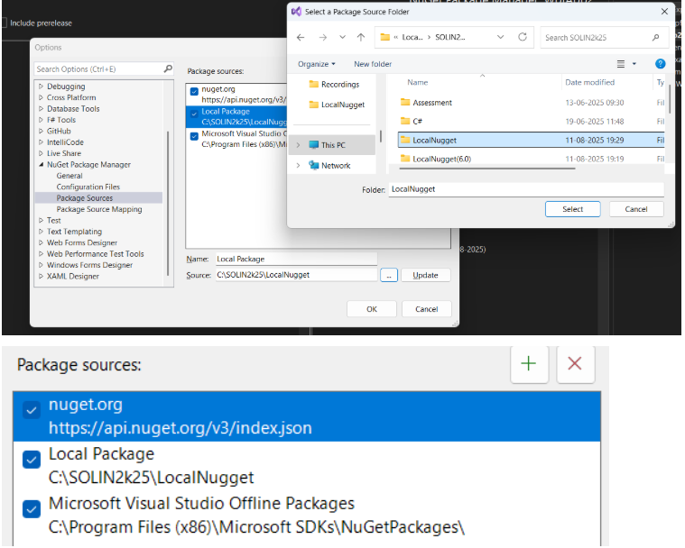
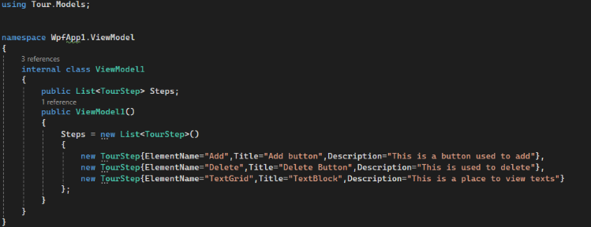
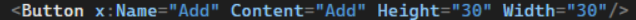
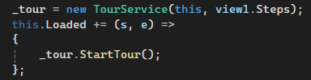

# WPFUserTour

Create **guided walkthroughs** and **user onboarding tours** inside your WPF applications.

---

## Installing via Local NuGet Package

1. Download the `.nupkg` file and save it to a local folder  
   *(e.g., `D:\LocalNugets\WpfUserTour`)*.

2. Open your WPF application in **Visual Studio**.

3. Go to:  
   `Tools → NuGet Package Manager → Package Manager Settings`.
    
    

4. Choose **Package Sources** in the left panel → click the **`+`** button to add a new source.  
   - Name: `Local Package` (or anything you like)  
   - Source: browse to the folder containing your `.nupkg` file
    
    
5. Right-click your project → **Manage NuGet Packages**.

6. In the **Package Source** dropdown (top right), select your newly added local source.

7. Install **WPFUserTour** from the list.

---

##  Using the Library

### 1. Define the tour steps (in your ViewModel)


- Define the list of steps in your viewmodel constructor.
- Example:


- Define a tourstep like this where the
  1. ElementName is the name of your UI Element ,
  2. Title is the title for your tour description dialog box and
  3. Description describes what you wish to convey.

- In your Xaml codebehind create an instance for the tour service and start the tour on loading the UI.
- Create a _tour instance and pass the parent and list of steps in to the constructor
- On Loading the elements call the StartTour()

    
- This will result in a tour overview for the elements that you’ve defined as a list of tour steps.
### Sample Output:


### 2.Customizable Tour
- You can use the default tourtip by just using the tour service .

  

- If you want to customize the style of your tooltip make sure you use the interface ITourOverlay and implement it in your code behind.(This ensures all element's availability for the functioning of tour service)

   

  

  1. Default output : 
    
    
    
  2. Custom output : 
  
    
# TourService Documentation

## Overview
The `TourService` is a WPF service designed to provide guided tours of an application's user interface. It highlights specific UI elements, overlays descriptive tooltips, and darkens the rest of the UI to guide users step-by-step through features or workflows.

It is intended for use in applications where onboarding, tutorials, or walkthroughs are needed without modifying the core UI.

---

## Components

### 1. TourService
- Handles the overall workflow of the guided tour.
- Maintains the list of `TourStep` objects.
- Tracks the current step index.
- Positions highlights, tooltips, and overlays dynamically.
- Handles navigation between steps (`Next` / `Prev`) and ending the tour.

### 2. TourStep (Model)
Represents a single step in the tour. Properties include:
- `ElementName` - Name of the UI element to highlight.
- `Tag` - Optional tag for additional filtering.
- `Title` - Tooltip title.
- `Description` - Tooltip content.

### 3. TourOverlay (View)
`TourOverlay.xaml` is a `UserControl` responsible for the visual representation of the tour. Key parts:

#### Structure
- `DarkOverlay` - A `Grid` covering the entire parent window with `Black` background at 70% opacity.
- `HighlightBorder` - A `Border` that visually highlights the target element with a yellow outline.
- `TooltipPanel` - A `Border` with stack panel containing:
  - `StepTitle` - Bold, centered title of the current step.
  - `StepDescription` - Detailed description.
  - Navigation buttons: `PrevButton` and `NextButton`.
- All visual elements are placed inside a `Canvas` for absolute positioning.

#### Styles & Animations
- **RoundedButtonStyle** - Custom style for the navigation buttons:
  - Black background, white text, rounded corners.
  - Mouse-over and pressed states change background color.
  - Disabled state changes background and text color.
- **FadeInStoryboard** - Smooth fade-in effect for the overlay (0 → 1 opacity in 0.7s).
- **FadeOutStoryboard** - Smooth fade-out effect (1 → 0 opacity in 0.3s).

---

## Internal Workflow

### Initialization
- `TourService` is initialized with `_parent` (UI container) and `_steps` (tour steps).
- Event handlers for `_parent.SizeChanged` and `_parent.LayoutUpdated` ensure highlights and tooltips reposition dynamically when the UI changes.

### Starting the Tour (`StartTour`)
1. Finds the window containing `_parent`.
2. Wraps existing content inside a `Grid` if necessary to host the overlay.
3. Adds `TourOverlay` to the visual tree with `ZIndex = MaxValue`.
4. Schedules the first step to display after the UI is loaded.

### Displaying a Step (`ShowStep`)
1. Validates the index of the step.
2. Searches for the target element using `FindChildByNameAndTag`.
   - Retries if element is not yet loaded.
   - Waits for `Loaded` if element is partially rendered.
3. Calls `PositionHighlight(step)`:
   - Positions `HighlightBorder` over the target element.
   - Calls `CreateOverlayMask(element)` to darken the rest of the UI while leaving a transparent hole for the element.
   - Positions `TooltipPanel` dynamically to avoid being cut off by window edges.
4. Updates `PrevButton` / `NextButton`.
5. Plays `FadeInStoryboard`.

### Highlight and Mask
- `HighlightBorder` is slightly larger than the element to create a glow.
- `OpacityMask` in `DarkOverlay` creates a "cutout" hole in the dimmed background.
- Mask updates dynamically when:
  - Window is resized.
  - Layout changes.
  - Current step changes.

### Navigation and Ending
- **Next / Prev Buttons**: Navigate through steps.
- **EndTour()**: Plays `FadeOutStoryboard` and removes overlay from visual tree.

### Visual Tree Search
- `FindChildByNameAndTag` recursively searches for `FrameworkElement` by `Name` and optional `Tag`.

---

## Design Considerations
1. **Dynamic UI Adaptation** - Ensures highlight and tooltip follow UI elements as they move or resize.
2. **Non-Intrusive** - Wraps existing UI in a `Grid` only if needed; overlay is added on top.
3. **Retry Mechanism** - Handles asynchronously loaded elements.
4. **Performance** - Only updates the current step; layout updates handled efficiently.
5. **Extensibility** - Steps can be added or modified; styles and animations can be customized in `TourOverlay.xaml`.

---

## Usage Example
```csharp
var steps = new List<TourStep>
{
    new TourStep { ElementName = "Button1", Title = "Click Me", Description = "This button does X" },
    new TourStep { ElementName = "TextBox1", Title = "Enter Text", Description = "Enter your name here" }
};

var tourService = new TourService(MainGrid, steps);
tourService.StartTour();


